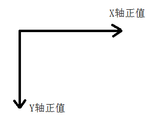

# box组件使用

----------

box容器为用于包裹其他UI组件的基础布局容器，采用flexbox模型布局，支持嵌套任意类型的UI组件或容器。

注：文本不支持直接放置于box容器中，请用&lt;text&gt;标签包裹使用。

## 属性 ##

**公共属性**  

[参见公共属性章节](https://gitdocument.exmobi.cn/sprite-begin/ggsx.html)，包括：id、style、class；


## 样式 ##  

**公共样式**  

[参见公共样式章节](https://gitdocument.exmobi.cn/sprite-begin/ggys.html)，包括：  

> 尺寸
> 
> 定位
> 
> 内边距
> 
> 外边距
> 
> 边框
> 
> 背景
> 
> flexbox布局


**background-image**  

<code>背景图片</code>

只支持本地图，当同时设置背景图及背景色时，背景图优先级别高于背景色。格式：background-image:url (url);

> 本地图片url路径格式：res:前缀，file:前缀，相对路径


## 事件 ##

本节目录：

> 
> [公共事件](#sj_1)   
> 
> [touchDown  按下UI组件时触发](#sj_2)  
> 
> [touchMove 在UI组件上面移动时多次触发](#sj_3)   
> 
> [touchUp  在UI组件上抬起时触发](#sj_4)   
>
> [touchCancel  意外导致当前touch过程中断时触发](#sj_5)  

<span id="sj_1">**公共事件**</span>  

[参见公共事件章节](https://gitdocument.exmobi.cn/sprite-begin/ggsj.html)，包括：  

> click事件
> 
> longTouch事件

<span id="sj_2">**touchDown**</span>  

<code>按下UI组件时触发</code>  

event事件对象包括： 

> type：事件类型，字符串类型，固定值：touchDown；  
> 
> target：触发事件的目标组件，dom对象；  
> 
> timestamp：事件触发的时间戳,单位毫秒，数字类型
 
param对象为Json对象，定义如下：
>  x：按下时x轴坐标值；
> 
>  y：按下时y轴坐标值；  

**注：**  

- 只要有按下去的动作touchDown一定会触发，一般用于做UI组件点击下去的效果。

- 对应android，只要touchDown触发，即便不移动touchMove也会触发。
 
示例：  

```javascript
var box1 = document.getElement("box1");
box1.on("touchDown",function(e){
	console.log("进入touchDown");
});
```  


```javascript
var box1 = document.getElement("box1");
box1.on("touchDown",function(e,param){
	console.log("进入touchDown"+param.x);
});
```  


<span id="sj_3">**touchMove**</span>  

<code>在UI组件上面移动时多次触发</code>  

event事件对象包括：   

> type：事件类型，字符串类型，固定值：touchMove；
> 
> target：触发事件的目标组件，dom对象；
> 
> timestamp：事件触发的时间戳,单位毫秒，数字类型
    
param对象为Json对象，定义如下：  

> x：移动时x轴坐标值；  
> 
> y：移动时y轴坐标值；  
> 
> distanceX：x轴相对于上次回传点的位移坐标值；  
> 
> distanceY：y轴相对于上次回传点的位移坐标值；

  


**注：** 当touchMove触发后，就不会触发click事件了。

示例： 

```javascript
var box1 = document.getElement("box1");
box1.on("touchMove",function(e,param){
	console.log("进入touchMove"+param.x);
});
```  

<span id="sj_4">**touchUp**</span>  

<code>在UI组件上抬起时触发</code>  

event事件对象包括：

> type：事件类型，字符串类型，固定值：touchUp；
> 
> target：触发事件的目标组件，dom对象；
> 
> timestamp：事件触发的时间戳,单位毫秒，数字类型

param对象为Json对象，定义如下：

> x：抬起时x轴坐标值；
> 
> y：抬起时y轴坐标值；

**注：**  如果box在滚动容器，当容器滚动的时候就不会触发touchUp了，这时会触发touchCancel事件。  


示例： 

```javascript
var box1 = document.getElement("box1");
box1.on("touchUp",function(e,param){
	console.log("touchUp"+param.x);
});

```


<span id="sj_5">**touchCancel**</span> 

<code>意外导致当前touch过程中断时触发</code>  

event事件对象包括： 

> type：事件类型，字符串类型，固定值：touchCancel；  
> 
> target：触发事件的目标组件，dom对象； 
> 
> timestamp：事件触发的时间戳,单位毫秒，数字类型

param对象为Json对象，定义如下：  

> x：抬起时x轴坐标值；  
> 
> y：抬起时y轴坐标值；

**注：**   

- 如果组件包含在滚动容器中，如果滑动滚动容器，一般情况会触发该事件。

- 如果要做组件点击抬起的效果，建议在touchUp和touchCancel里面都执行抬起的效果代码。  

示例： 

```javascript
var box1 = document.getElement("box1");
box1.on("touchCancel",function(e,param){
	console.log("touchCancel"+param.x);
});
```


## js方法 ##  


## 示例 ##


 


