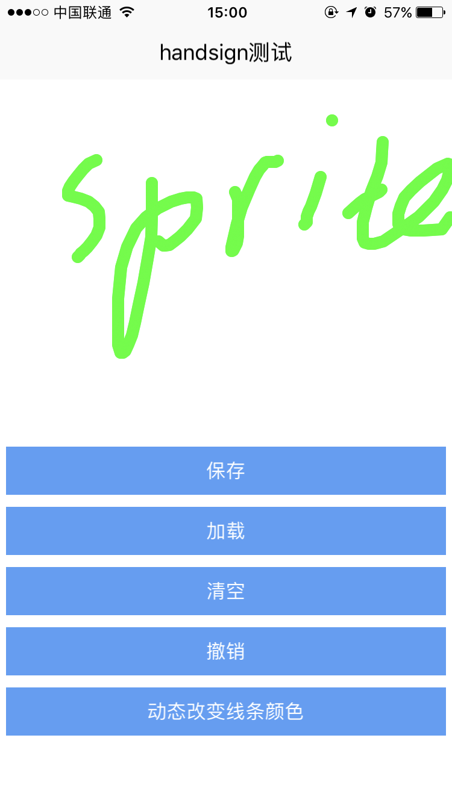

# handsign组件使用 

----------

手写签名组件，提供画笔绘制区域，最后生成一个图片可以得到图片地址做后续操作。

**注：**  不要在可滑动的容器中使用该控件，比如scroll，slider等

<h2 id="cid_1">属性</h2>   


**公共属性**  

[参见公共属性章节](https://gitdocument.exmobi.cn/sprite-begin/ggsx.html)，包括：id、style、class；  


<h2 id="cid_2">样式</h2>  

**公共样式**  

[参见公共样式章节](https://gitdocument.exmobi.cn/sprite-begin/ggys.html)，包括：  
 
> 尺寸
> 
> 定位 
>  
> 外边距
>
> 边框
>  
> 背景
> 
> flexbox布局：align-self，flex


**line-color**  

<code>画笔线条颜色</code>  

默认值#333333；

**line-size**  

<code>画笔线条宽度</code>  

取值数字，单位dp，默认为2


<h2 id="cid_3">事件</h2>

无


<h2 id="cid_4">js方法</h2>   


<span id="ff_1">**公共方法**</span>  

[事件相关](https://gitdocument.exmobi.cn/sprite-begin/ggff.html#cid_0)，包括：

> [void on(messageName,function)   组件注册事件的触发函数](https://gitdocument.exmobi.cn/sprite-begin/ggff.html#jjxg_1)   
> 
> [void fire(messageName,params)  组件事件的触发函数](https://gitdocument.exmobi.cn/sprite-begin/ggff.html#jjxg_2)   
> 
> [void off(messageName,function)  组件移除事件的触发函数](https://gitdocument.exmobi.cn/sprite-begin/ggff.html#jjxg_3)  
>  
> [Array getOn(messageName)  获取已绑定的事件的触发函数](https://gitdocument.exmobi.cn/sprite-begin/ggff.html#jjxg_4)   

[动画相关](https://gitdocument.exmobi.cn/sprite-begin/ggff.html#cid_1)，包括： 


> [void startAnimation(jsonData,function)  启动UI组件动画](https://gitdocument.exmobi.cn/sprite-begin/ggff.html#dhxg_1)  
> 
> [void startAnimator(jsonData,function)  启动UI组件属性动画](https://gitdocument.exmobi.cn/sprite-begin/ggff.html#dhxg_2)   
> 
> [void startKeyFrameAnimator(jsonData,function)  启动UI组件关键帧动画](https://gitdocument.exmobi.cn/sprite-begin/ggff.html#dhxg_3)  
>  
> [void  releaseAnimator()  结束控件动画](https://gitdocument.exmobi.cn/sprite-begin/ggff.html#dhxg_4)   

[尺寸和位置](https://gitdocument.exmobi.cn/sprite-begin/ggff.html#cid_2)，包括：  

> [jsonData getFrame()  获取组件在父容器中的位置](https://gitdocument.exmobi.cn/sprite-begin/ggff.html#cchwz_1)   
> 
> [void setFrame(frame)  设置组件在父容器中的位置](https://gitdocument.exmobi.cn/sprite-begin/ggff.html#cchwz_2)   
> 
> [jsonData getCenter()  获取组件中心点在父容器中的位置](https://gitdocument.exmobi.cn/sprite-begin/ggff.html#cchwz_3)  
>
> [jsonData getAbsoluteFrame()  获取组件在绘制窗口中的位置](https://gitdocument.exmobi.cn/sprite-begin/ggff.html#cchwz_4)   


[普通Dom节点操作](https://gitdocument.exmobi.cn/sprite-begin/ggff.html#cid_3)，包括：  

> [domObj getParent()  获取父节点](https://gitdocument.exmobi.cn/sprite-begin/ggff.html#ptdom_1)   
> 
> [domObj getNext()  获取同级下一个节点](https://gitdocument.exmobi.cn/sprite-begin/ggff.html#ptdom_2)   
> 
> [domObj getPrevious()  获取同级前一个节点](https://gitdocument.exmobi.cn/sprite-begin/ggff.html#ptdom_3)  
> 
> [void remove()  从父容器中移除自身](https://gitdocument.exmobi.cn/sprite-begin/ggff.html#ptdom_4)  
> 
 
> [void setAttr(attrName,attrValue)  设置节点属性](https://gitdocument.exmobi.cn/sprite-begin/ggff.html#ptdom_6)   
>
> [String getAttr(attrName)  获取节点属性](https://gitdocument.exmobi.cn/sprite-begin/ggff.html#ptdom_7) 
>
> [Json getAttrs()  获取节点所有属性](https://gitdocument.exmobi.cn/sprite-begin/ggff.html#ptdom_8) 
>
> [void removeAttr(attrName)  移除节点属性](https://gitdocument.exmobi.cn/sprite-begin/ggff.html#ptdom_9) 
>
> [bool hasAttr(attrName)  节点是否具有该属性](https://gitdocument.exmobi.cn/sprite-begin/ggff.html#ptdom_10) 
> 
> [void setStyle(styleName,styleValue)  设置节点样式值](https://gitdocument.exmobi.cn/sprite-begin/ggff.html#ptdom_13)  
>
> [String getStyle(styleName)  获取节点样式值](https://gitdocument.exmobi.cn/sprite-begin/ggff.html#ptdom_14)   
>
> [void clearStyle(styleName)  移除节点样式值](https://gitdocument.exmobi.cn/sprite-begin/ggff.html#ptdom_15)    
>
> [void setClassStyle(className，domobj)   设置节点对应Class样式](https://gitdocument.exmobi.cn/sprite-begin/ggff.html#ptdom_16) 
>  
> [String getClassStyle()  获取节点已设置Class样式](https://gitdocument.exmobi.cn/sprite-begin/ggff.htm#ptdom_17)  
>  
> [String getTag()  获取UI组件类型](https://gitdocument.exmobi.cn/sprite-begin/ggff.html#ptdom_18)  
>  
> [String getId()  获取UI组件Id标识](https://gitdocument.exmobi.cn/sprite-begin/ggff.html#ptdom_19) 


**void load(jsonData, callBackFun)**  

<code>手写签批组件加载已有图片</code>  

参数：  

jsonData：加载参数设置，Json对象，定义如下： 


> path：加载图片文件路径（包含文件名），支持res: file:，字符串类型，必选项； 

callBackFun：加载图片回调，该回调函数具有Json对象入参，定义如下：  

> code ：回应状态码，数字[0,-1]
> 
> - 0：加载成功；
> 
> - -1：加载失败； 


返回值：无


**void save(jsonData, callBackFun)**  

<code>将手写签名绘制保存为图片</code> 

参数：

jsonData：保存参数设置，Json对象，定义如下：

>   path：保存文件路径（包含文件名），支持res: file:，字符串类型，必选项； 

callBackFun：保存图片回调，该回调函数具有Json对象入参，定义如下：

> code ：回应状态码，数字[0,-1]
> 
> - 0：保存成功；
> 
> - -1：保存失败；
> 
> path：保存文件路径（包含文件名），支持res: file:，字符串类型；

返回值：无


**void clear()**  

<code>清空绘制区域</code>    

参数：无 

返回值：无


**void undo()**  

<code>回退操作</code>  

参数：无  

返回值：无  


<h2 id="cid_5">示例</h2>  


示例代码，测试handsign事件和方法，参考演示应用示例：apps\yuanhongqian\spriteui\handsign.uixml，代码中用到了官方封装的titlebar等组件，模板的使用可参考[https://gitdocument.exmobi.cn/sprite-official-ui/index.html](https://gitdocument.exmobi.cn/sprite-official-ui/index.html "https://gitdocument.exmobi.cn/sprite-official-ui/index.html") 

```html

<page>
    <script>
        <![CDATA[
        var index = 1;
        var window = require("Window");
        var document = require("Document");
        var ui = require("UI");
        require("titlebarUI");
        require("buttonUI");
        var console = require("Console");
        var handsign = null;
        function toast(msg) {
            var json = {};
            json.content = msg;
            ui.toast(json);
        }

        window.on("loaded", function () {
            handsign = document.getElement("handsign");
            //触发回调 监听顶层box 根据id区分
            var box = document.getElement("box");
            box.on("click", function (e) {
                var id = e.target.getId();
                //onclick()函数测试触发
                if (id == "save") {
                    var json = {};
                    json.path = "res:handsign/1.png";
                    handsign.save(json, savecallBack);

                } else if (id == "load") {
                    var json = {};
                    json.path = "res:handsign/1.png";
                    handsign.load(json, loadCallBack);
                } else if (id == "clear") {
                    handsign.clear();
                } else if (id == "clear") {
                    handsign.clear();
                } else if (id == "undo") {
                    handsign.undo();
                } else if (id == "cssChange") {
                    handsign.setStyle("line-size", "10");
                    handsign.setStyle("line-color", "green");
                }
            });
            //titlebar关闭页面
            var title = document.getElement("title");
            title.on("ltextClick", function (e) {
                var json = {};
                window.close(json);

            });
        });

        function savecallBack(json) {
            if (json.code == 0) {
                var img = document.getElement("img");
                img.setAttr("src", "res:handsign/1.png");

            } else {
                toast("保存失败");
            }

        }

        function loadCallBack(json) {
            if (json.code == 0) {
                toast("加载成功");

            } else {
                toast("加载失败");
            }
        }
    ]]>
    </script>
    <style>
        @import url(res:spritetest/css/import.css);
        button {
            margin: 5 5 5 5;
        }
    </style>
    <ui>
        <box class="rootBox" id="box">
            <titlebar title="handsign测试" id="title"  style="height: 66;padding:20 0 0 0"/>
            <box style="flex:1">
                <handsign id="handsign" style="width:fill_screen;height:300;" />
                <button value="保存" id="save" />
                <button value="加载" id="load" />
                <button value="清空" id="clear" />
                <button value="撤销" id="undo" />
                <button value="动态改变线条颜色" id="cssChange" />
                <image id="img" style="width:fill_screen;height:300" />
            </box>
        </box>
    </ui>
</page>

```

  