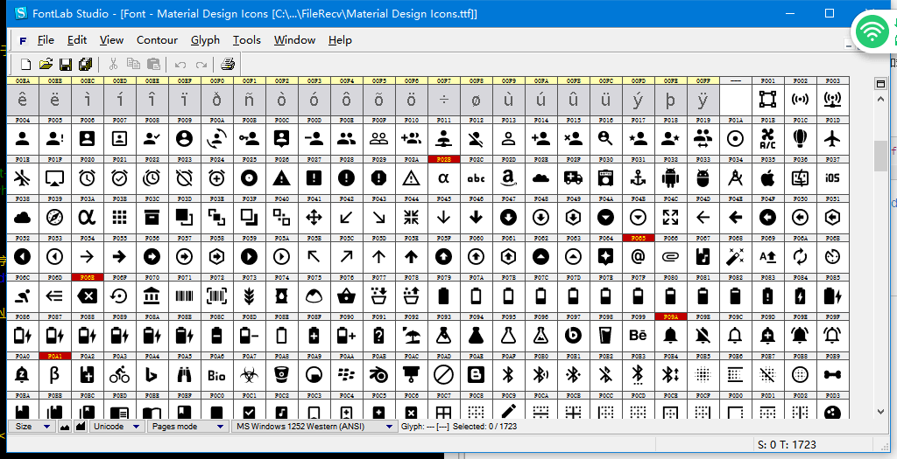

# iconfont组件使用 

----------

<h2 id="cid_0">说明</h2>  

iconfont在web上的应用已经很广泛，它能有效的解决分辨率的问题，并且在应用的时候非常便捷，节省前端、设计很多重复改图、调色的工作。在移动设备上众多DPI设备更是一个困扰问题设计师、前端的大问题；一个app在适配高低版本iphone手机及分辨率众多的安卓设备的时候设计师需要设计很多版本的图片，而iconfont这种矢量图形就能很好解决这种重复设计的工作，同时对js模板封装也很有好处，目前可见好处包括：  

>  1：轻松解决图标资源适配问题，无论什么分辨率，图片都是超级清晰的；
>  
>  2：轻松改变颜色，大小，背景，圆角，轮廓各种属性；
>  
>  3：减少安装包大小；
>  
>  4：可实现跨平台，一套资源，web，ios，android都能用；
>  
>  5：资源维护很方便  iconfont常用网站参考：
>  http://www.iconfont.cn/plus
>  http://fontello.com/
>  https://icomoon.io/


iconfont文字图组件用于文字图展示，支持通过css样式font-family设置需要加载字体库后使用，格式为\uxxxx，如：\ue674 。  
 
示例： 

```html
<iconfont style="font-family:Material Design Icons;color:#549FF7;font-size:45;text-align:center;width:45;height:45">\u343c</iconfont>

``` 

Sprint平台内置了一套字体库，字体库文件下载：[http://pan.baidu.com/s/1i5dtRXr](http://pan.baidu.com/s/1i5dtRXr)  

字体文件查看工具：专业字体编辑工具(Fontlab Studio) v5.2.2

  


**注：**

- 确保字体库文件名称与实际字体文件一致，如xxx.ttf 对应的字体名也为xxx；
 
- iconfont组件设置的font-family值即为字体库名，如xxx.ttf，则font-family：xxx；

- 文本值为\u+四位字体图编码 如：\u3439；

- 如需使用自己定义的字体库，可以在edn上面打包的时候上传自己的字体库文件，打包的时候进行集成。


<h2 id="cid_1">属性</h2>   


**公共属性**  

[参见公共属性章节](https://gitdocument.exmobi.cn/sprite-begin/ggsx.html)，包括：id、style、class；  


<h2 id="cid_2">样式</h2>  

**公共样式**  

[参见公共样式章节](https://gitdocument.exmobi.cn/sprite-begin/ggys.html)，包括：  
 
> 尺寸
> 
> 定位 
> 
> 内边距
> 
> 外边距
> 
> 背景
>
> 文本样式
> 
> flexbox布局：align-self，flex

**font-family**  

<code>字体名称</code> 

字符串类型


**singleline**  

<code>设置font控件为单行显示</code>  

取值：[true,false]  

> true：单行显示；
> 
> false：多行显示；（默认）


**maxlines**  

<code>设置文本显示最大行数</code>

取值：数字  

**注：**   

- 若不设置该属性则视为自动扩充  

- 设置该属性后，会空出最大行数的位置


<h2 id="cid_3">事件</h2>


[参见公共事件章节](https://gitdocument.exmobi.cn/sprite-begin/ggsj.html)，包括：  

> click事件
> 
> longTouch事件


<h2 id="cid_4">js方法</h2>   


<span id="ff_1">**公共方法**</span>  

[事件相关](https://gitdocument.exmobi.cn/sprite-begin/ggff.html#cid_0)，包括：

> [void on(messageName,function)   组件注册事件的触发函数](https://gitdocument.exmobi.cn/sprite-begin/ggff.html#jjxg_1)   
> 
> [void fire(messageName,params)  组件事件的触发函数](https://gitdocument.exmobi.cn/sprite-begin/ggff.html#jjxg_2)   
> 
> [void off(messageName,function)  组件移除事件的触发函数](https://gitdocument.exmobi.cn/sprite-begin/ggff.html#jjxg_3)  
>  
> [Array getOn(messageName)  获取已绑定的事件的触发函数](https://gitdocument.exmobi.cn/sprite-begin/ggff.html#jjxg_4)   

[动画相关](https://gitdocument.exmobi.cn/sprite-begin/ggff.html#cid_1)，包括： 


> [void startAnimation(jsonData,function)  启动UI组件动画](https://gitdocument.exmobi.cn/sprite-begin/ggff.html#dhxg_1)  
> 
> [void startAnimator(jsonData,function)  启动UI组件属性动画](https://gitdocument.exmobi.cn/sprite-begin/ggff.html#dhxg_2)   
> 
> [void startKeyFrameAnimator(jsonData,function)  启动UI组件关键帧动画](https://gitdocument.exmobi.cn/sprite-begin/ggff.html#dhxg_3)  
>  
> [void  releaseAnimator()  结束控件动画](https://gitdocument.exmobi.cn/sprite-begin/ggff.html#dhxg_4)   

[尺寸和位置](https://gitdocument.exmobi.cn/sprite-begin/ggff.html#cid_2)，包括：  

> [jsonData getFrame()  获取组件在父容器中的位置](https://gitdocument.exmobi.cn/sprite-begin/ggff.html#cchwz_1)   
> 
> [void setFrame(frame)  设置组件在父容器中的位置](https://gitdocument.exmobi.cn/sprite-begin/ggff.html#cchwz_2)   
> 
> [jsonData getCenter()  获取组件中心点在父容器中的位置](https://gitdocument.exmobi.cn/sprite-begin/ggff.html#cchwz_3)  
>
> [jsonData getAbsoluteFrame()  获取组件在绘制窗口中的位置](https://gitdocument.exmobi.cn/sprite-begin/ggff.html#cchwz_4)   


[普通Dom节点操作](https://gitdocument.exmobi.cn/sprite-begin/ggff.html#cid_3)，包括：  

> [domObj getParent()  获取父节点](https://gitdocument.exmobi.cn/sprite-begin/ggff.html#ptdom_1)   
> 
> [domObj getNext()  获取同级下一个节点](https://gitdocument.exmobi.cn/sprite-begin/ggff.html#ptdom_2)   
> 
> [domObj getPrevious()  获取同级前一个节点](https://gitdocument.exmobi.cn/sprite-begin/ggff.html#ptdom_3)  
> 
> [void remove()  从父容器中移除自身](https://gitdocument.exmobi.cn/sprite-begin/ggff.html#ptdom_4)  
> 
 
> [void setAttr(attrName,attrValue)  设置节点属性](https://gitdocument.exmobi.cn/sprite-begin/ggff.html#ptdom_6)   
>
> [String getAttr(attrName)  获取节点属性](https://gitdocument.exmobi.cn/sprite-begin/ggff.html#ptdom_7) 
>
> [Json getAttrs()  获取节点所有属性](https://gitdocument.exmobi.cn/sprite-begin/ggff.html#ptdom_8) 
>
> [void removeAttr(attrName)  移除节点属性](https://gitdocument.exmobi.cn/sprite-begin/ggff.html#ptdom_9) 
>
> [bool hasAttr(attrName)  节点是否具有该属性](https://gitdocument.exmobi.cn/sprite-begin/ggff.html#ptdom_10) 
>
> [void setText(content)  设置节点文本内容](https://gitdocument.exmobi.cn/sprite-begin/ggff.html#ptdom_11)
>
> [void getText(content)  获取节点文本内容](https://gitdocument.exmobi.cn/sprite-begin/ggff.html#ptdom_12)
> 
> [void setStyle(styleName,styleValue)  设置节点样式值](https://gitdocument.exmobi.cn/sprite-begin/ggff.html#ptdom_13)  
>
> [String getStyle(styleName)  获取节点样式值](https://gitdocument.exmobi.cn/sprite-begin/ggff.html#ptdom_14)   
>
> [void clearStyle(styleName)  移除节点样式值](https://gitdocument.exmobi.cn/sprite-begin/ggff.html#ptdom_15)    
>
> [void setClassStyle(className，domobj)   设置节点对应Class样式](https://gitdocument.exmobi.cn/sprite-begin/ggff.html#ptdom_16) 
>  
> [String getClassStyle()  获取节点已设置Class样式](https://gitdocument.exmobi.cn/sprite-begin/ggff.htm#ptdom_17)  
>  
> [String getTag()  获取UI组件类型](https://gitdocument.exmobi.cn/sprite-begin/ggff.html#ptdom_18)  
>  
> [String getId()  获取UI组件Id标识](https://gitdocument.exmobi.cn/sprite-begin/ggff.html#ptdom_19) 


<h2 id="cid_5">示例</h2>  


示例代码，测试iconfont展现，参考演示应用示例：apps\yuanhongqian\sprite_xiaoguo\iconfont.uixml，代码中用到了官方封装的模板titlebar，模板的使用可参考[https://gitdocument.exmobi.cn/spriteui/index.html](https://gitdocument.exmobi.cn/spriteui/index.html "https://gitdocument.exmobi.cn/spriteui/index.html") 

```html
<page>
    <script>
        <![CDATA[

        var window = require("Window");
        var document = require("Document");
        var time = require("Time");
        var ui = require("UI");
        // var GridListAdapter = require("GridListAdapter");
        var console = require("Console");

        var app = require("App");

        require("titlebarUI");
        require("buttonUI");
        require("switchUI");


        var screenWidth = window.getScreenWidth();
        var s = 0;
        var e = 1722;
        var datas = new Array();
        var adapter = null;
        // var gridlist = null;
        var scrollid = null;

        window.on("animator", function () {

            scrollid = document.getElement("scrollid");
            // gridlist = document.getElement("gridlist");
            //关闭页面
            var titleid = document.getElement("titleid");
            titleid.on("liconClick", function (e) {
                var json = {};
                window.close(json);
            });


            time.setTimeout(function () {
                var str = '';
                for (var i = 1; i <= e; i++) {
                    var fonticon = '';
                    var hex16 = i.toString(16).toUpperCase();
                    if (hex16.length == 1) {
                        fonticon = "00" + hex16;
                    }

                    if (hex16.length == 2) {
                        fonticon = "0" + hex16;
                    }

                    if (hex16.length == 3) {
                        fonticon = hex16;
                    }

                    str = str + '<box class="column-flex-center" style="width:60;height:60;margin:8 0 8 0">'
                        + '<iconfont style="font-family:Material Design Icons;color:#549FF7;font-size:45;text-align:center;width:45;height:45">\\uF' + fonticon + '</iconfont>'
                        + '<text style="font-size:13;text-align:center">\\uF' + fonticon + '</text>'
                        + ' </box>';
                }
                var xmlstr = '<box class="row-flex-start  align-items-start" style="flex-wrap:wrap;">'
                    + '' + str + ''
                    + ' </box>';
                var dom = document.createElementByXml(xmlstr);
                scrollid.clear();
                scrollid.appendChild(dom);
                scrollid.refresh();
            }, 10);

        });   
    ]]>
    </script>
    <style>
        @import url("spriteLayout");
        @import url("spriteColor");
    </style>
    <ui>
        <box class="full" style="background-color:#dddddd" id="box">
            <titlebar id="titleid" class="titlebar-hasstatus" style="background-color:#549FF7;title-color:#ffffff;right-color:#ffffff"
                title="字体图" licon="res:yuanhongqian/image/back.png"></titlebar>
                <scroll class="flex1 " style="align-items:center;" id="scrollid">
                    <image style="height:40;width:40;margin:10" src="res:yuanhongqian/image/loading.gif" />
                </scroll>
        </box>
    </ui>
</page>
```

代码效果：

  
 

