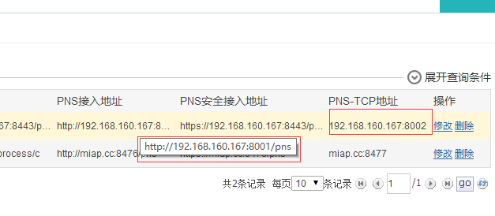
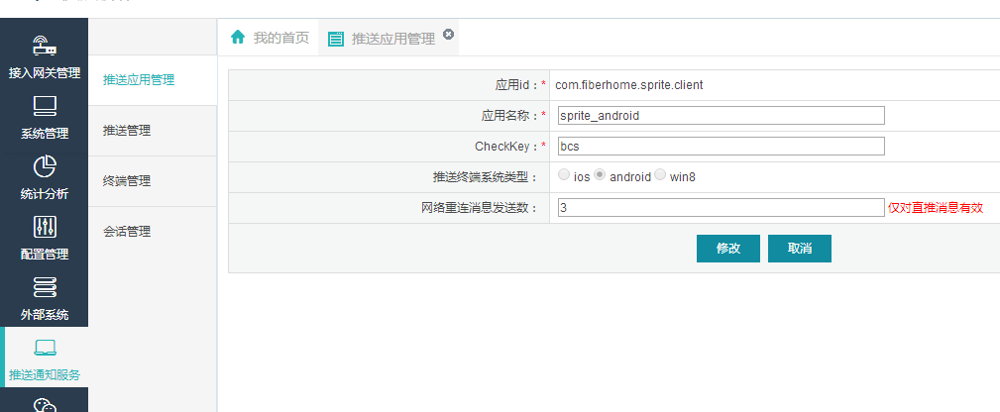
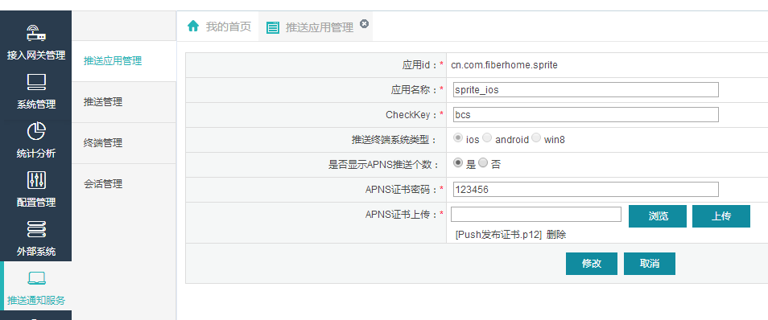
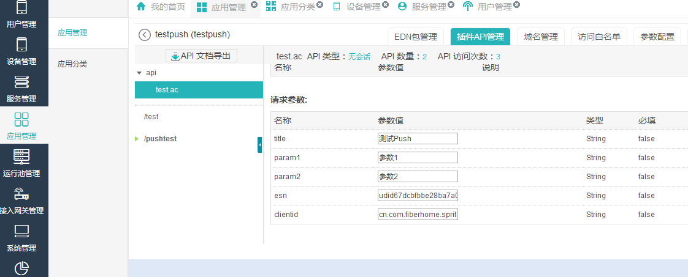
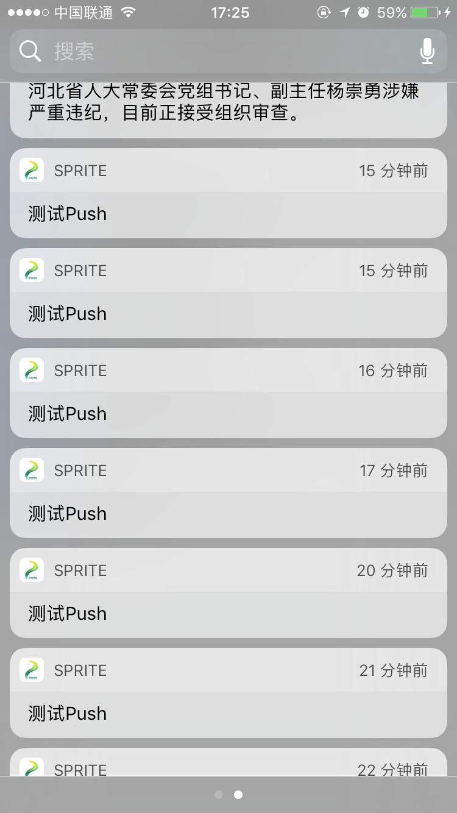
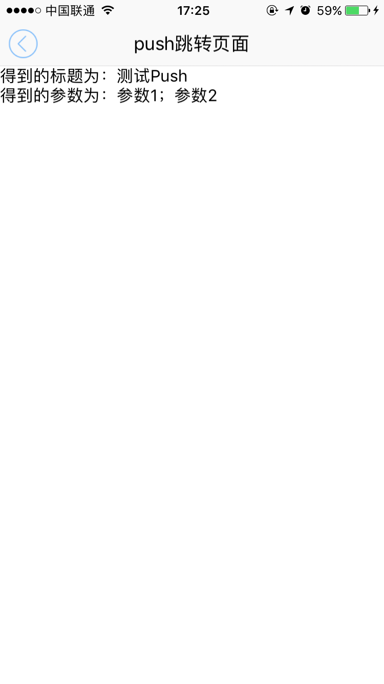

# push推送讲解

----------

<h2 id="cid_1">概述说明</h2>   

推送是移动应用非常重要的功能，本章主要描述Sprite中如何集成及使用ExMobi/Mplus服务器提供的push推送功能。  

ExMobi Push并非Sprite的默认模块，若应用需要使用ExMobi推送，则Edn或Mbuilder打包时需要勾选ExMobi Push模块。

使用ExMobiPush组件来实现push相关功能，相关方法调用可放置于任意页面中，但事件监听需必须放置于homeJs应用入口JS中。

<h2 id="cid_1">使用场景</h2>  

**Android**

移动应用中Push使用场景一般包括以下几种，分别予以说明：

1：程序已启动且运行于前台：

回调应用入口JS中ExMobiPush组件message事件，且系统会构建通知栏，点击通知栏，会回调应用入口JS中ExMobiPush组件messageClick事件

2：程序已启动且运行于后台：

同1

3：程序未启动：

系统会构建通知栏，点击通知栏，会进入程序入口JS中App组件监听的launch事件，type为notification，开发人员执行后续处理。


**IOS**


移动应用中Push使用场景一般包括以下几种，分别予以说明：

1：程序已启动且运行于前台：

若设备为iOS10及以上系统，则会回调应用入口JS中ExMobiPush组件message事件，同时系统会构建通知栏，点击通知栏，会回调应用入口JS中ExMobiPush组件messageClick事件

若设备为iOS10以下系统，则会回调应用入口JS中ExMobiPush组件message事件 

2：程序已启动且运行于后台：

若设备为iOS10及以上系统，系统会构建通知栏，点击通知栏，会回调应用入口JS中ExMobiPush组件messageClick事件

若设备为iOS10以下系统，系统会构建通知栏，点击通知栏，会回调应用入口JS中ExMobiPush组件message事件

3：程序未启动：

系统会构建通知栏，点击通知栏，会进入程序入口JS中App组件监听的launch事件，type为notification，开发人员执行后续处理。


<h2 id="cid_1">示例讲解</h2>  

关于ExMobiPush工具类API说明，这里不做详细介绍，开发者可以查看  [ExMobiPush 工具类](https://gitdocument.exmobi.cn/sprite-advanced/exmobipush.html)  

下面我们就通过一个示例来详细讲解如可开发一个push功能。

**第一步：**

在exmobi6的服务器上配置PNS的接入地址，一般情况下服务器部署的时候已经配置好，这里我们只需要查看下该配置项，如图：



然后紧接着配置sprite客户端的pns接入权限：

android的配置:



其中应用id，就是应用程序包名。

ios的配置：



其中应用id，就是应用程序的bundleid，另外ios还需要上传push推送证书。

**第二步：**

在应用程序的入口页面home.js里面，编写push初始化方法，代码如下：

```javascript
var exmobipush = require("ExMobiPush");
var pushjson = {};
//pns注册地址
pushjson.registerUrl = "http://miap.cc:8476/pns";
//pns连接地址,android支持
pushjson.pushUrl = "miap.cc:8477";
pushjson.defaultStartPush = true;

//push初始化
exmobipush.init(pushjson);
//push启动
exmobipush.start();

```
然后紧接着，编写push监听触发事件，代码如下：

```javascript
exmobipush.on("message", function (e, param) {
    var osv = device.getOsVersion().split(".")[0];
    var os = device.getOs();
    if (Number(osv) < 10 && os.toUpperCase() == "IOS") {
        //处理ios10以下系统 在应用开启状态并且在前台收到push h 在状态栏上没有提示，这里处理下。

        var title = param.content.title;
        var param1 = param.content.param.param1;
        var param2 = param.content.param.param2;
        var pageurl = param.content.page;

        var json = {};
        json.url = "res:yuanhongqian/spritedemo/" + pageurl;
        json.target = "_blank";
        json.id = "DomTest";
        json.statusBarColor = "#f9f9f9";
        json.openAnimation = "push_r2l";
        json.closeAnimation = "push_l2r";
        json.data = {};
        json.data.title = title;
        json.data.param1 = param1;
        json.data.param2 = param2;
        window.open(json);

    }
});

exmobipush.on("messageClick", function (e, param) {
    console.log("进入了messageClick" + JSON.stringify(param));

    var title = param.content.title;
    var param1 = param.content.param.param1;
    var param2 = param.content.param.param2;
    var pageurl = param.content.page;
    var json = {};
    json.url = "res:yuanhongqian/spritedemo/" + pageurl;
    json.target = "_blank";
    json.id = "DomTest";
    json.statusBarColor = "#f9f9f9";
    json.openAnimation = "push_r2l";
    json.closeAnimation = "push_l2r";
    json.data = {};
    json.data.title = title;
    json.data.param1 = param1;
    json.data.param2 = param2;
    window.open(json);


});

```

同时在程序启动入口处也做push处理：

```javascript
app.on("launch", function (e, jsonData) {
    console.log("入口程序:" + jsonData.type);
    var type = jsonData.type;
    if (type == "normal") {
        //正常桌面启动
        var json = {};
        json.url = "res:index.uixml";
        json.target = "_blank";
        json.id = "DomTest";
        json.statusBarColor = "#f9f9f9";
        json.openAnimation = "push_r2l";
        json.closeAnimation = "push_l2r";
        json.data = {};
        json.data.text = "传值成功";
        window.open(json);
    }
    else if (type == "app") {
        //其他应用调用启动
        var json = {};
        json.url = "res:spritetest/page/index2.uixml";
        json.target = "_blank";
        json.id = "DomTest";
        json.statusBarColor = "rgb(69,181,239)";
        json.openAnimation = "push_r2l";
        json.closeAnimation = "push_r2l";
        json.data = {};
        json.data = jsonData.data;
        window.open(json);
    }
    else if (type == "notification") {
        //推送消息启动
        console.log("入口程序push启动");
        var param = jsonData.data;
        var title = param.content.title;
        var param1 = param.content.param.param1;
        var param2 = param.content.param.param2;
        var pageurl = param.content.page;
        var json = {};
        json.url = "res:yuanhongqian/spritedemo/" + pageurl;
        json.target = "_blank";
        json.id = "DomTest";
        json.statusBarColor = "#f9f9f9";
        json.openAnimation = "push_r2l";
        json.closeAnimation = "push_l2r";
        json.data = {};
        json.data.title = title;
        json.data.param1 = param1;
        json.data.param2 = param2;
        window.open(json);
    }
    else if (type == "localNotification") {
        //本地通知启动
    }
});

```

**第三步：**

编写pushtestshow.uixml页面用于push跳转测试，代码如下：

```html
<page>
    <script>
        <![CDATA[

        var window = require("Window");
        var document = require("Document");
        var ui = require("UI");
        var app = require("App");
        var console = require("Console");

        function alert(msg) {
            var json = {};
            json.title = "提示";
            json.content = msg;
            json.buttonText = "确定";
            ui.alert(json, alertCall);
        }

        window.on("loaded", function () {
            var imageid = document.getElement("imageid");
            imageid.on("click", function (e) {
                var json = {};
                window.close(json);
            });


            var jsondata = window.getData();
            console.log(JSON.stringify(jsondata));
            document.getElement("titletext").setText("得到的标题为：" + jsondata.title);
            document.getElement("paramtext").setText("得到的参数为：" + jsondata.param1 + "；" + jsondata.param2);
            document.refresh();
        });

    ]]>
    </script>
    <style>
        @import url("spriteLayout");
        @import url("spriteColor");
    </style>
    <ui>
        <box class="bg-white full">
            <box class="titlebar">
                <text class="titlebar-text black">push跳转页面</text>
                <box id="imageid" class="titlebar-lcaption">
                    <image class="margin8 titlebar-image" src="res:yuanhongqian/image/bx.png" />
                </box>
                <box class="titlebar-rcaption">
                    <text class="margin8 text-center peter-river"></text>
                </box>
            </box>
            <line />

            <box>
                <text id="titletext"></text>
                <text id="paramtext"></text>
            </box>
        </box>
    </ui>
</page>
```

**第四步：**

编写服务端推送代码，可以参考[《ExMobi6服务端开发入门》中的push章节](https://gitdocument.exmobi.cn/exmobi6-server-begin/service_api.html#cid_4)。  

开发者也可以使用[exmobi5的服务端push的写法](https://edu.exmobi.cn/learn/TtI7ehsSw39dhN5m)，通过标签来请求pns服务器，只不过clientid要换成应用的包名或bundleid。

exmobi5服务端推送代码示例：

```jsp
<%-- ExMobi JSP文件，注释和取消快捷键统一为Ctrl+/ 多行注释为Ctrl+Shift+/ --%>
<%@ page language="java" import="java.util.*"
 contentType="application/json; charset=UTF-8" pageEncoding="UTF-8"%>
<%@ include file="/client/adapt.jsp"%>
<%@ include file="/client/adapt_extend.jsp"%>
<%
  String title = aa.req.getParameter("title");
  String param1 = aa.req.getParameter("param1");
  String param2 = aa.req.getParameter("param2");
  String clientid = aa.req.getParameter("clientid");
  String esn = aa.req.getParameter("esn");
%>
<aa:direct-push id="mypush" directPushType="app" titleHead="<%=title %>" title="<%=title %>" page="pushtestshow.uixml">
    <aa:push-receiver clientid="<%=clientid %>" esn="<%=esn %>" >
	</aa:push-receiver>	
	<aa:push-params>
       <aa:push-param name="param1" value="<%=param1 %>"/>
       <aa:push-param name="param2" value="<%=param2 %>"/>
    </aa:push-params>
</aa:direct-push>
<%
String str = aa.regex.regex(".*","mypush");
out.print(str);
%>
```

**第五步：**

把开发好的服务端代码上传到ExMobi6平台，war包方式开发的可以从“服务管理”上传，exmobi5的应用工程可以通过“应用管理”上传，具体exmobi6服务端的使用可以参考[《ExMobi6服务接入指南》](https://gitdocument.exmobi.cn/exmobi6-server-access-guide/index.html)


**第六步：**

在服务端可以通过接口进行调试：



关于esn的获取自行通过sprite客户端Device工具类 device.getEsn() 获取。  

手机上呈现效果如图：  

  


