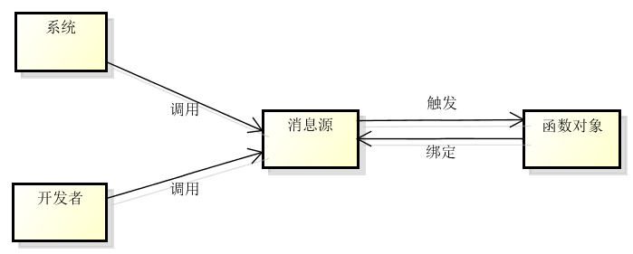
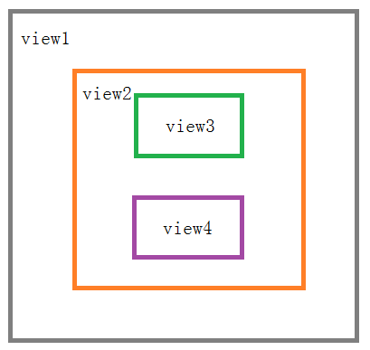

# 事件触发机制

----------

Spirite中所有触发事件都是通过js事件绑定来实现,不支持在ui标签中直接定义触发事件处理函数。

正确用法：

```
<button value="Sprite"/>
   
spriteButton.on("click",function(){
//点击触发
});

``` 

错误用法：

```
<button onclick="test()" value="Sprite"/> 
```

<h2 id="cid_0">事件基础</h2>

事件源：事件的来源,即发出这个消息的对象；

事件名：事件的唯一标示；

附加数据：事件附带的数据；

系统消息：由Sprite发送出来的消息,消息名称固定,如onload,onclick等；

自定义消息：由开发者自己定义并发送的消息,消息的名称自定义；


<h2 id="cid_1">发布/订阅模式</h2>

发布/订阅模式是Sprite消息机制的核心,其特点就是降低耦合度,让二个独立的对象不互相依赖,结构清晰。

Sprite事件触发模式如下图所示：



1：系统/开发者和函数互不依赖,系统/开发者只管触发一个消息,并不关心谁去接收；

2：系统/开发者和函数必须能获取到消息源对象；

3：函数订阅消息时需要标示消息名称和函数对象的引用；

4：可以多个函数对象订阅同一个消息源同一名字的消息；

5：消息源触发消息会通知所有已订阅函数对象；


<h2 id="cid_2">事件绑定</h2>

obj.on("事件名",function(event,param1,param2...))：向sprite组件注册事件的触发函数,支持
 
示例：

```javascript
 //注册系统点击事件
button.on("click",function(event){
	var eventType = event.type;
	var targetObj = event.target;
	var timestamp = event.timestamp;
});

//注册自定义事件
button.on("login",function(event,param1,param2){
	var eventType = event.type;
	//获取传递参数1
	var p1 = param1;
	//获取传递参数2
	var p2 = param2;
});
```

<h2 id="cid_3">事件触发</h2>

obj.fire("事件名")：向sprite组件注册事件的触发函数

obj.fire("事件名",参数数组)：向sprite组件注册事件的触发函数,并传递参数

示例：

```javascript
//无参数事件触发 
button.fire("click");
//带参数事件触发
var params = new Array();
params.concat("George","John");
button.fire("login", params);
```

<h2 id="cid_4">事件移除</h2>

obj.off("事件名")：移除组件所有注册 "事件名" 的触发函数；

obj.off("事件名", function)：移除组件注册 "事件名" 的触发函数

示例：

```javascript
//移除所有事件触发 
button.off("click");

//移除指定函数事件触发 
button.off("click",onButtonClick);

function onButtonClick(){
//函数触发
}

```

<h2 id="cid_5">系统事件</h2>

click： 单击UI组件时候触发,绑定于UI组件上；

loaded：页面加载完成后触发,绑定于Window组件上；

resume：页面激活时触发,绑定于Window组件上；

pause：页面被覆盖时触发,绑定于Window组件上；

destroy：页面被销毁时触发,绑定于Window组件上；

result：接收上层页面关闭回传数据,绑定于Window组件上；

back：点击设备返回键触发,绑定于Window组件上；

menu：点击设备菜单键触发,绑定于Window组件上；

activate：程序从后台被切换至前台时触发；

inactivate：程序从前台被切换至后台时触发；


<h2 id="cid_6">事件作用域</h2>

**页面作用域**

订阅和触发的消息源必须为同一作用域同一个对象,同一页面内消息触发可正常进行。

示例：

```javascript
//注册自定义事件
button.on("login",function(event,param1,param2){
var eventType = event.type;
//获取传递参数1
var p1 = param1;
//获取传递参数2
var p2 = param2;
});

//触发自定义事件
var params = new Array();
params.concat("George","John");
button.fire("login", params);
```

**程序作用域** 

若希望实现跨页面消息订阅和传递,则通过对App应用级作用域绑定和操作事件来实现。

示例：

```javascript
 //页面A注册自定义事件
var  app = require("App");
app.on("login",function(e,param1, param2){
   //执行后续操作
});

//页面B触发自定义事件调用页面A操作,并传递参数
var  app = require("App");
//触发自定义事件
var params = new Array();
params.concat("George","John");
app.fire("login", params);
```

<h2 id="cid_7">屏幕事件</h2>

Sprite屏幕触发事件采用冒泡方式处理,即点击事件开始的时候由页面中嵌套层次最深的那个节点接收,然后逐级向上传播到上层容器中。



 如上图所示,点击view3时候,click事件执行顺序为view3->view2->view1，若view3注册了onclick点击监听事件,则点击view3时候被拦截进入view3监听函数中处理，若view3未注册onclick点击监听事件,则进入view2监听处理,依次向上冒泡。

滑动事件处理也采用冒泡机制，需要注意的是一般控件不处理滑动事件，因此在该控件上的滑动事件会依次上传给父容器处理,若父容器设置了对move事件监听,则交给该容器监听函数处理,不再上传,若未设置,则继续上传给父容器,依次向上冒泡。
