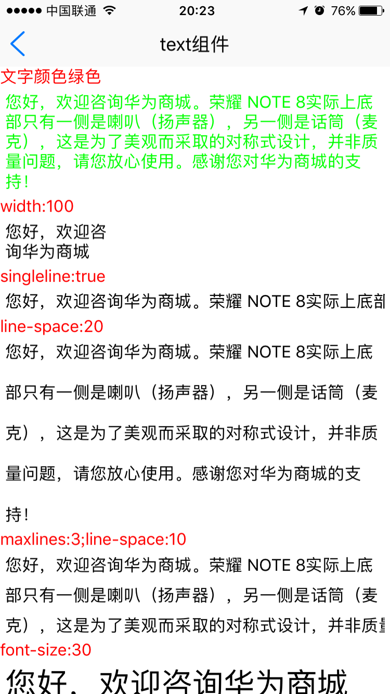
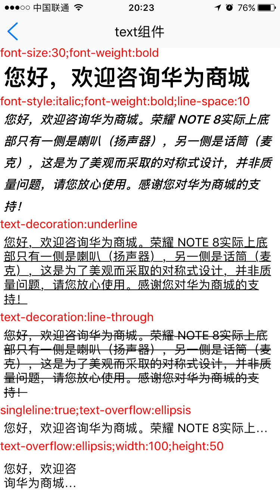

# text组件使用 

----------

text文本控件用于显示文本展示，text内部仅支持放置需要显示的文本字符串。  

<h2 id="cid_0">属性</h2> 


**公共属性**  

[参见公共属性章节](https://gitdocument.exmobi.cn/sprite-begin/ggsx.html)，包括：id、style、class；

<h2 id="cid_1">样式</h2>

**公共样式**  

[参见公共样式章节](https://gitdocument.exmobi.cn/sprite-begin/ggys.html)，包括：  

> 尺寸
> 
> 定位
> 
> 内边距
> 
> 外边距
> 
> 边框
> 
> 背景
> 
> flexbox布局：align-self，flex 

**line-space**  

<code>文本行间距</code>

取值：数字，单位dp  


**singleline**  

<code>设置font控件为单行显示</code>  

取值：[true,false]  

> true：单行显示；
> 
> false：多行显示；（默认）


**maxlines**  

<code>设置文本显示最大行数</code>

取值：数字  

**注：**   

- 若不设置该属性则视为自动扩充  

- 设置该属性后，会空出最大行数的位置

<h2 id="cid_2">事件</h2>

[参见公共事件章节](https://gitdocument.exmobi.cn/sprite-begin/ggsj.html)，包括：  

> click事件
> 
> longTouch事件  


<h2 id="cid_3">js方法</h2>

**公共方法**  

[事件相关](https://gitdocument.exmobi.cn/sprite-begin/ggff.html#cid_0)，包括：

> [void on(messageName,function)   组件注册事件的触发函数](https://gitdocument.exmobi.cn/sprite-begin/ggff.html#jjxg_1)   
> 
> [void fire(messageName,params)  组件事件的触发函数](https://gitdocument.exmobi.cn/sprite-begin/ggff.html#jjxg_2)   
> 
> [void off(messageName,function)  组件移除事件的触发函数](https://gitdocument.exmobi.cn/sprite-begin/ggff.html#jjxg_3)  
>  
> [Array getOn(messageName)  获取已绑定的事件的触发函数](https://gitdocument.exmobi.cn/sprite-begin/ggff.html#jjxg_4)   

[动画相关](https://gitdocument.exmobi.cn/sprite-begin/ggff.html#cid_1)，包括： 


> [void startAnimation(jsonData,function)  启动UI组件动画](https://gitdocument.exmobi.cn/sprite-begin/ggff.html#dhxg_1)  
> 
> [void startAnimator(jsonData,function)  启动UI组件属性动画](https://gitdocument.exmobi.cn/sprite-begin/ggff.html#dhxg_2)   
> 
> [void startKeyFrameAnimator(jsonData,function)  启动UI组件关键帧动画](https://gitdocument.exmobi.cn/sprite-begin/ggff.html#dhxg_3)  
>  
> [void  releaseAnimator()  结束控件动画](https://gitdocument.exmobi.cn/sprite-begin/ggff.html#dhxg_4)   

[尺寸和位置](https://gitdocument.exmobi.cn/sprite-begin/ggff.html#cid_2)，包括：  

> [jsonData getFrame()  获取组件在父容器中的位置](https://gitdocument.exmobi.cn/sprite-begin/ggff.htm#cchwz_1)   
> 
> [void setFrame(frame)  设置组件在父容器中的位置](https://gitdocument.exmobi.cn/sprite-begin/ggff.htm#cchwz_2)   
> 
> [jsonData getCenter()  获取组件中心点在父容器中的位置](https://gitdocument.exmobi.cn/sprite-begin/ggff.htm#cchwz_3)  
>
> [jsonData getAbsoluteFrame()  获取组件在绘制窗口中的位置](https://gitdocument.exmobi.cn/sprite-begin/ggff.htm#cchwz_4)   


[普通Dom节点操作](https://gitdocument.exmobi.cn/sprite-begin/ggff.html#cid_3)，包括：  

> [domObj getParent()  获取父节点](https://gitdocument.exmobi.cn/sprite-begin/ggff.htm#ptdom_1)   
> 
> [domObj getNext()  获取同级下一个节点](https://gitdocument.exmobi.cn/sprite-begin/ggff.htm#ptdom_2)   
> 
> [domObj getPrevious()  获取同级前一个节点](https://gitdocument.exmobi.cn/sprite-begin/ggff.htm#ptdom_3)  
> 
> [void remove()  从父容器中移除自身](https://gitdocument.exmobi.cn/sprite-begin/ggff.htm#ptdom_4)  
> 
 
> [void setAttr(attrName,attrValue)  设置节点属性](https://gitdocument.exmobi.cn/sprite-begin/ggff.htm#ptdom_6)   
>
> [String getAttr(attrName)  获取节点属性](https://gitdocument.exmobi.cn/sprite-begin/ggff.htm#ptdom_7) 
>
> [Json getAttrs()  获取节点所有属性](https://gitdocument.exmobi.cn/sprite-begin/ggff.htm#ptdom_8) 
>
> [void removeAttr(attrName)  移除节点属性](https://gitdocument.exmobi.cn/sprite-begin/ggff.htm#ptdom_9) 
>
> [bool hasAttr(attrName)  节点是否具有该属性](https://gitdocument.exmobi.cn/sprite-begin/ggff.htm#ptdom_10) 
>
> [void setText(content)  设置节点文本内容](https://gitdocument.exmobi.cn/sprite-begin/ggff.htm#ptdom_11)
>
> [void getText(content)  获取节点文本内容](https://gitdocument.exmobi.cn/sprite-begin/ggff.htm#ptdom_12)
> 
> [void setStyle(styleName,styleValue)  设置节点样式值](https://gitdocument.exmobi.cn/sprite-begin/ggff.htm#ptdom_13)  
>
> [String getStyle(styleName)  获取节点样式值](https://gitdocument.exmobi.cn/sprite-begin/ggff.htm#ptdom_14)   
>
> [void clearStyle(styleName)  移除节点样式值](https://gitdocument.exmobi.cn/sprite-begin/ggff.htm#ptdom_15)    
>
> [void setClassStyle(className，domobj)   设置节点对应Class样式](https://gitdocument.exmobi.cn/sprite-begin/ggff.htm#ptdom_16) 
>  
> [String getClassStyle()  获取节点已设置Class样式](https://gitdocument.exmobi.cn/sprite-begin/ggff.htm#ptdom_17)  
>  
> [String getTag()  获取UI组件类型](https://gitdocument.exmobi.cn/sprite-begin/ggff.htm#ptdom_18)  
>  
> [String getId()  获取UI组件Id标识](https://gitdocument.exmobi.cn/sprite-begin/ggff.htm#ptdom_19) 


<h2 id="cid_4">示例</h2>  


示例代码1，测试text布局样式，参考演示应用示例：apps\yuanhongqian\spriteui\text.uixml，代码中用到了官方封装的模板titlebar，模板的使用可参考[https://gitdocument.exmobi.cn/spriteui/index.html](https://gitdocument.exmobi.cn/spriteui/index.html "https://gitdocument.exmobi.cn/spriteui/index.html") 

```html

<page>
    <script>
        <![CDATA[
        var window = require("Window");
        var document = require("Document");
        var Time = require("Time");
        var ui = require("UI");
        require("titlebarUI");
        window.on("loaded", function () {
            var title = document.getElement("title");
            title.on("liconClick", function (e) {
                var json = {};
                window.close(json);
            });
        });    
    ]]>
    </script>
    <style>
        @import url("spriteLayout");
        @import url("spriteColor");
        scroll {
            width: fill_screen;
            flex: 1;
        }
        
        text {
            margin: 5 5 5 5;
        }
        
        .text {
            margin: 0 0 0 0;
            color: red;
        }
    </style>
    <ui>
        <box class="full">
            <titlebar title="text组件" id="title" licon="res:yuanhongqian/image/icon.png" style="licon-width:24;licon-height:24" class="titlebar-hasstatus"
            />
            <scroll id="scroll">
                <text class="text">文字颜色绿色</text>
                <text style="color:green">您好，欢迎咨询华为商城。荣耀 NOTE 8实际上底部只有一侧是喇叭（扬声器），另一侧是话筒（麦克），这是为了美观而采取的对称式设计，并非质量问题，请您放心使用。感谢您对华为商城的支持！
                </text>
                <text class="text">width:100</text>
                <text style="width:100;">您好，欢迎咨询华为商城</text>
                <text class="text">singleline:true</text>
                <text style="singleline:true"> 您好，欢迎咨询华为商城。荣耀 NOTE 8实际上底部只有一侧是喇叭（扬声器），另一侧是话筒（麦克），这是为了美观而采取的对称式设计，并非质量问题，请您放心使用。感谢您对华为商城的支持！
                </text>
                <text class="text">line-space:20</text>
                <text style="line-space:20">您好，欢迎咨询华为商城。荣耀 NOTE 8实际上底部只有一侧是喇叭（扬声器），另一侧是话筒（麦克），这是为了美观而采取的对称式设计，并非质量问题，请您放心使用。感谢您对华为商城的支持！
                </text>
                <text class="text">maxlines:3;line-space:10</text>
                <text style="maxlines:3;line-space:10"> 您好，欢迎咨询华为商城。荣耀 NOTE 8实际上底部只有一侧是喇叭（扬声器），另一侧是话筒（麦克），这是为了美观而采取的对称式设计，并非质量问题，请您放心使用。感谢您对华为商城的支持！
                </text>
                <text class="text">font-size:30</text>
                <text style="font-size:30"> 您好，欢迎咨询华为商城</text>
                <text class="text">font-weight:bold</text>
                <text style="font-weight:bold">您好，欢迎咨询华为商城</text>
                <text class="text">font-size:30;font-weight:bold</text>
                <text style="font-size:30;font-weight:bold"> 您好，欢迎咨询华为商城</text>
                <text class="text">font-style:italic;font-weight:bold;line-space:10</text>
                <text style="font-style:italic;font-weight:bold;line-space:10"> 您好，欢迎咨询华为商城。荣耀 NOTE 8实际上底部只有一侧是喇叭（扬声器），另一侧是话筒（麦克），这是为了美观而采取的对称式设计，并非质量问题，请您放心使用。感谢您对华为商城的支持！</text>
                <text class="text">text-decoration:underline</text>
                <text style="text-decoration:underline">您好，欢迎咨询华为商城。荣耀 NOTE 8实际上底部只有一侧是喇叭（扬声器），另一侧是话筒（麦克），这是为了美观而采取的对称式设计，并非质量问题，请您放心使用。感谢您对华为商城的支持！</text>
                <text class="text">text-decoration:line-through</text>
                <text style="text-decoration:line-through">您好，欢迎咨询华为商城。荣耀 NOTE 8实际上底部只有一侧是喇叭（扬声器），另一侧是话筒（麦克），这是为了美观而采取的对称式设计，并非质量问题，请您放心使用。感谢您对华为商城的支持！</text>
                <text class="text">singleline:true;text-overflow:ellipsis</text>
                <text style="singleline:true;text-overflow:ellipsis">您好，欢迎咨询华为商城。荣耀 NOTE 8实际上底部只有一侧是喇叭（扬声器），另一侧是话筒（麦克），这是为了美观而采取的对称式设计，并非质量问题，请您放心使用。感谢您对华为商城的支持！</text>
                <text class="text">text-overflow:ellipsis;width:100;height:50</text>
                <text style="text-overflow:ellipsis;width:100;height:50">您好，欢迎咨询华为商城。荣耀 NOTE 8实际上底部只有一侧是喇叭（扬声器），另一侧是话筒（麦克），这是为了美观而采取的对称式设计，并非质量问题，请您放心使用。感谢您对华为商城的支持！</text>
            </scroll>
        </box>
    </ui>
</page>

```

代码效果：

    


