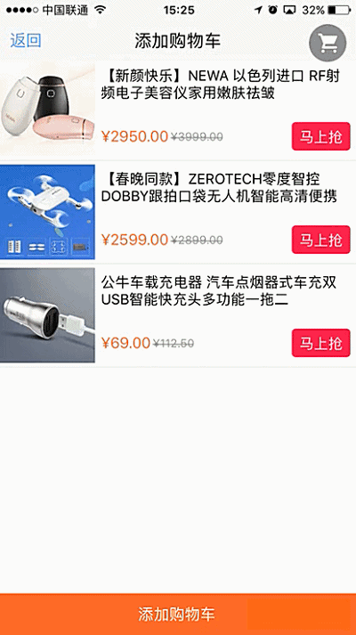
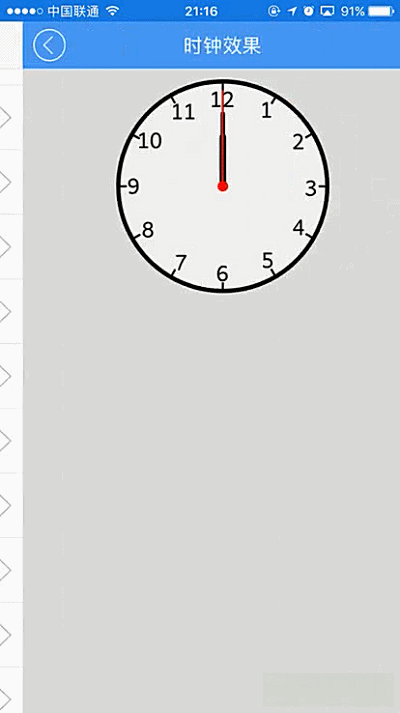

# 组件动画介绍

----------

<h2 id="cid_1">概述说明</h2>   

动画是移动开发中用户体验非常重要的一个部分，Sprite动画效果非常强大，开发者通过几行代码，即可实现与原生一致的动画体验。 

Sprite动画包括：页面过场动画，控件UI动画，控件属性动画，其他，第二节分别予以说明。


<h2 id="cid_1">动画种类</h2>  

**页面过场动画**  

页面打开/关闭时过场动画，通过JS方法打开/关闭页面时设置，支持以下动画效果：

- none：无动画效果（默认）
 
- slide_l2r：从左至右滑出

- slide_r2l：从右至左滑出

- slide_b2t：从下至上滑出

- slide_t2b：从上至下滑出

- push_l2r：从左至右推出
 
- push_r2l：从右至左推出

- push_b2t：从底至上推出

- push_t2b：从上至底推出

- fade：淡入淡出 

 打窗动画：Window.open()，[详见该函数说明](https://gitdocument.exmobi.cn/sprite-api/window.html#ff_0)

 关窗动画：Window.close()，[详见该函数说明](https://gitdocument.exmobi.cn/sprite-api/window.html#ff_2)


**控件UI动画**  

 基础UI组件动画，这种动画只是做效果，并不会改变UI组件真实属性，支持以下四种基本的动画效果：

-  opacity透明度动画；
 
-  transfer位移动画；
 
-  scale缩放动画；

-  rotate旋转动画；

 调用方式：UI组件对象方法 startAnimation(jsonData,function)，[详见该函数说明](https://gitdocument.exmobi.cn/sprite-api/ggff.html#dhxg_1)


**控件属性动画和属性帧动画**  

通过动画的方式改变对象的属性，动画实质就是在一个时间轴里修改这些属性的值，和UI动画的差别在于属性变化是真实值的变化，支持以下基本属性设置，支持设置动画同时执行，顺序执行；

- x：控件左上角X轴坐标，数字；

- y：控件左上角Y轴坐标，数字；

- translationX：控件X轴方向位移，数字；
 
- translationY：控件Y轴方向位移，数字；

- scaleX：控件X轴方向缩放比例，数字；

- scaleY：控件Y轴方向缩放比例，数字；

- rotation：控件Z轴旋转角度，数字；

- rotationX：控件X轴旋转角度，数字；

- rotationY：控件Y轴旋转角度，数字；

- opacity：控件透明度设置，数字，取值，[0,1]；
 
- textColor：文字色值设置，字符串类型，#aarrggbb

- backgroundColor：背景色设置，字符串类型，#aarrggbb

调用方式：UI组件对象方法 startAnimator(jsonData,function)，[详见该函数说明](https://gitdocument.exmobi.cn/sprite-api/ggff.html#dhxg_2) 和 
startKeyFrameAnimator(jsonData:Object,callback:Function): void [详见该函数说明](https://gitdocument.exmobi.cn/sprite-api/ggff.html#dhxg_3) 

**其他**  

UI组件本身提供缺省动画，如slider容器左右滑动切换动画等。


<h2 id="cid_1">示例展示</h2>  

示例1：

多种UI动画组合实现商品添加购物车效果，参考演示应用示例：apps\yuanhongqian\sprite_xiaoguo\taobaocar.uixml 代码如下：

```html
<page>
    <script>
        <![CDATA[
        var window = require("Window");
        var document = require("Document");
        var ui = require("UI");
        var console = require("Console");
        var myappjs = require("myapp");
        var app = require("App");

        require("titlebarUI");
        require("buttonUI");

        var screenWidth = window.getScreenWidth();

        var json;
        var clonedow;
        window.setStatusBarMode("default");

        window.on("loaded", function () {

            //关闭页面
            var titleid = document.getElement("titleid");
            var shangping = document.getElement("shangping");
            var tianjiacar = document.getElement("tianjiacar");
            var car = document.getElement("car");
            var box = document.getElement("box");
            var tianjiatag = null;
            var tag = true;

            var tagbox = "box_s1";
            titleid.on("ltextClick", function (e) {
                var json = {};
                window.close(json);
            });

            car.on("click", function (e) {
                var json = {};
                window.close(json);
            });

            var tianjiacar = document.getElement("tianjiacar");

            tianjiacar.on("click", function (e) {

                if (tag == true) {
                    tag = false;//这里设置一个保护动画完成值，避免狂点添加购物车
                    json = tianjiatag.getAbsoluteFrame();
                    clonedow = tianjiatag.clone("true");
                    //默认克隆第一个商品
                    box.appendChild(clonedow);
                    clonedow.setStyle("position", "absolute");
                    clonedow.setStyle("left", json.x);
                    clonedow.setStyle("top", json.y);
                    box.refresh();

                    //旋转
                    var = {};
                    jsonData.fillAfter = 0;
                    var animationSet = new Array(): Object;
                    var rotateAni = {};
                    rotateAni.type = "rotate";
                    rotateAni.delay = 0;
                    rotateAni.duration = "600";
                    rotateAni.curve = "linear";
                    rotateAni.fromDegree = 0;
                    rotateAni.toDegree = 1000;
                    animationSet.push(rotateAni);

                    //缩放
                    var scaleAni = {};
                    scaleAni.type = "scale";
                    scaleAni.delay = "0";
                    scaleAni.duration = "600";
                    scaleAni.curve = "linear";
                    scaleAni.scaleFromX = 1;
                    scaleAni.scaleToX = 0.1;
                    scaleAni.scaleFromY = 1;
                    scaleAni.scaleToY = 0.1;
                    animationSet.push(scaleAni);
                    var json2 = car.getAbsoluteFrame();
                    //位移
                    var transferAni = {};
                    transferAni.type = "transfer";
                    transferAni.delay = "0";
                    transferAni.duration = "600";
                    transferAni.curve = "linear";
                    transferAni.fromX = 0;
                    transferAni.toX = (json2.x - json.x) - 30;
                    transferAni.fromY = 0;
                    transferAni.toY = -json2.y - json.y + 20;
                    animationSet.push(transferAni);
                    jsonData.animationSet = animationSet;
                    clonedow.startAnimation(jsonData, function () {
                        clonedow.remove();
                        document.refresh();
                        tag = true;
                    });

                }
            });
            tianjiatag = shangping;

            var bodyid = document.getElement("bodyid");
            var box_s1 = document.getElement("box_s1");
            var box_s2 = document.getElement("box_s2");
            var box_s3 = document.getElement("box_s3");
            box_s1.on("click", function (e) {
                selectobj(this);
            });
            box_s2.on("click", function (e) {
                selectobj(this);
            });
            box_s3.on("click", function (e) {
                selectobj(this);
            });
            function selectobj(obj) {
                if (obj.getId() == "box_s1") {
                    // clonedow =  obj.getFirstChild().clone("true");
                    // json = obj.getFirstChild().getAbsoluteFrame();
                    tianjiatag = obj.getFirstChild();

                    obj.setStyle("background-color", "#ececec");
                    document.getElement("box_s2").setStyle("background-color", "#ffffff");
                    document.getElement("box_s3").setStyle("background-color", "#ffffff");
                }
                if (obj.getId() == "box_s2") {
                    tianjiatag = obj.getFirstChild();
                    obj.setStyle("background-color", "#ececec");
                    document.getElement("box_s1").setStyle("background-color", "#ffffff");
                    document.getElement("box_s3").setStyle("background-color", "#ffffff");
                }
                if (obj.getId() == "box_s3") {
                    // console.log(targetObj.getFirstChild());
                    //clonedow =  obj.getFirstChild().clone("true");
                    //json = obj.getFirstChild().getAbsoluteFrame();

                    tianjiatag = obj.getFirstChild();
                    // console.log("json.y:"+json.y);
                    obj.setStyle("background-color", "#ececec");
                    document.getElement("box_s2").setStyle("background-color", "#ffffff");
                    document.getElement("box_s1").setStyle("background-color", "#ffffff");
                }
            };

        });

    ]]>
    </script>
    <style>
        @import url("spriteLayout");
        @import url("spriteColor");
        text {
            margin: 0 2 0 0;
        }
        
        line {
            margin: 4 0 4 0;
            line-size: 0.5;
        }
        
        button {
            background-color-click: #FF5556;
        }
    </style>
    <ui>
        <box class="full" style="" id="box">
            <titlebar id="titleid" class="titlebar-hasstatus" style="" ltext="返回" title="添加购物车"></titlebar>
            <box class="flex1" id="bodyid">
                <box id="box_s1" class="row-flex-start align-items-start">
                    <image id="shangping" src="res:yuanhongqian/image/shangping1.jpg" style="width:100;height:100" />
                    <box class="flex1 " style="padding: 6;">
                        <box>
                            <text style="font-size:15">【新颜快乐】NEWA 以色列进口 RF射频电子美容仪家用嫩肤祛皱</text>

                        </box>
                        <box class="flex1" />
                        <box style="flex-direction:row; ">
                            <text style="color:#FF6633;font-size:16dp">¥2950.00</text>
                            <text style="color:#9d9d9d;font-size:12dp;text-decoration:line-through">¥3999.00</text>
                            <box class="flex1" />
                            <button value="马上抢" style="background-color:#FF1556;height: 30;font-size:15;border-radius: 4; "></button>
                        </box>
                    </box>
                </box>
                <line />

                <box id="box_s2" class="row-flex-start align-items-start">
                    <image src="res:yuanhongqian/image/shangping2.jpg" style="width:100;height:100" />
                    <box class="flex1 " style="padding: 6;">
                        <box>
                            <text style="font-size:15">【春晚同款】ZEROTECH零度智控DOBBY跟拍口袋无人机智能高清便携</text>
                        </box>
                        <box class="flex1" />
                        <box style="flex-direction:row; ">
                            <text style="color:#FF6633;font-size:16dp">¥2599.00</text>
                            <text style="color:#9d9d9d;font-size:12dp;text-decoration:line-through">¥2899.00</text>
                            <box class="flex1" />
                            <button value="马上抢" style="background-color:#FF1556;height: 30;font-size:15;border-radius: 4; "></button>
                        </box>
                    </box>

                </box>
                <line />
                <box id="box_s3" class="row-flex-start align-items-start">
                    <image src="res:yuanhongqian/image/shangping3.jpg" style="width:100;height:100" />
                    <box class="flex1 " style="padding: 6;">
                        <box>
                            <text style="font-size:15">公牛车载充电器 汽车点烟器式车充双USB智能快充头多功能一拖二</text>
                        </box>
                        <box class="flex1" />
                        <box style="flex-direction:row; ">
                            <text style="color:#FF6633;font-size:16dp">¥69.00</text>
                            <text style="color:#9d9d9d;font-size:12dp;text-decoration:line-through">¥112.50</text>
                            <box class="flex1" />
                            <button value="马上抢" style="background-color:#FF1556;height: 30;font-size:15;border-radius: 4; "></button>
                        </box>
                    </box>
                </box>
                <line />
            </box>

            <box id="tianjiacar" class="column-flex-center" style="height:44;background-color:#FF6633">
                <text style="color:#ffffff; text-align:center">添加购物车</text>
            </box>
            <box id="car" class="row-flex-center" style="width:40;height:40;border-radius:20;background-color:rgba(0, 0, 0, 0.4);position:absolute;top:25;right:10">
                <image src="res:yuanhongqian/image/shopcart.png" style="width:25;height:25" />
            </box>
        </box>
    </ui>
</page>
```
代码效果图：




示例2：

使用属性旋转动画加定时器，实现时钟效果，参考演示应用示例：apps\yuanhongqian\sprite_xiaoguo\clock.uixml 代码如下：

```html
<page>
    <script>
        <![CDATA[
        var window = require("Window");
        var document = require("Document");
        var time = require("Time");
        var ui = require("UI");

        var console = require("Console");

        var app = require("App");

        require("titlebarUI");
        require("buttonUI");
        require("switchUI");
        var myappjs = require("myapp");
        var date = new Date();

        var d_housrs = date.getHours();
        var d_minute = date.getMinutes();
        var d_senond = date.getSeconds()

        var s = (d_senond % 60) * 6;
        var m = (d_minute % 60) * 6;
        var h = (d_housrs % 12) * 30 + Math.floor(m / 72) * 6;
        var screenWidth = window.getScreenWidth();


        app.on("activate", function () {

            // console.log("进入了activate");
            var date = new Date();

            d_housrs = date.getHours();
            d_minute = date.getMinutes();
            d_senond = date.getSeconds()

            s = (d_senond % 60) * 6;
            m = (d_minute % 60) * 6;
            h = (d_housrs % 12) * 30 + Math.floor(m / 72) * 6;

        });

        window.on("animator", function () {
            //关闭页面
            var titleid = document.getElement("titleid");
            var box = document.getElement("box");
            var senond = document.getElement("senond");
            var minute = document.getElement("minute");
            var hour = document.getElement("hour");

            titleid.on("liconClick", function (e) {
                var json = {};
                window.close(json);
            });

            var = {};
            var aniAry = new Array(): Object;


            var jsonAni = {};
            jsonAni.pivotX = 0.5;
            jsonAni.pivotY = 1;

            jsonAni.delay = 0;
            jsonAni.duration = 200;
            jsonAni.curve = "linear";
            jsonAni.props = {};
            jsonAni.props.rotation = s;
            aniAry.push(jsonAni);

            jsonData.animators = aniAry;
            var this_senond = senond;
            senond.startAnimator(jsonData, function () { });


            var jsonData2 = {};
            var aniAry2 = new Array();
            var jsonAni2 = {};
            jsonAni2.pivotX = 0.5;
            jsonAni2.pivotY = 1;
            jsonAni2.delay = 0;
            jsonAni2.duration = 200;
            jsonAni2.curve = "linear";
            jsonAni2.props = {};
            jsonAni2.props.rotation = m;
            aniAry2.push(jsonAni2);

            jsonData2.animators = aniAry2;
            minute.startAnimator(jsonData2, function () { });
            var jsonData3 = {};
            var aniAry3 = new Array();
            var jsonAni3 = {};
            jsonAni3.pivotX = 0.5;
            jsonAni3.pivotY = 1;
            jsonAni3.delay = 0;
            jsonAni3.duration = 200;
            jsonAni3.curve = "linear";
            jsonAni3.props = {};
            jsonAni3.props.rotation = h;
            aniAry3.push(jsonAni3);

            jsonData3.animators = aniAry3;

            hour.startAnimator(jsonData3, function () { });
            var timeid = time.setInterval(function () {
                s = s + 6;
                var = {};
                var aniAry = new Array(): Object;
                var jsonAni = {};
                jsonAni.pivotX = 0.5;
                jsonAni.pivotY = 1;
                jsonAni.delay = 0;
                jsonAni.duration = 1;
                jsonAni.curve = "linear";
                jsonAni.props = {};
                jsonAni.props.rotation = s;
                aniAry.push(jsonAni);
                jsonData.animators = aniAry;
                var this_senond = senond;
                senond.startAnimator(jsonData, function () {
                    // console.log(s+"；余数："+s % 360);
                    if (s % 360 == 0) {
                        s = 0;
                        m = m + 6;
                        var jsonData2 = {};
                        var aniAry2 = new Array();
                        var jsonAni2 = {};
                        jsonAni2.pivotX = 0.5;
                        jsonAni2.pivotY = 1;
                        jsonAni2.delay = 0;
                        jsonAni2.duration = 1;
                        jsonAni2.curve = "linear";
                        jsonAni2.props = {};
                        jsonAni2.props.rotation = m;
                        aniAry2.push(jsonAni2);
                        jsonData2.animators = aniAry2;
                        minute.startAnimator(jsonData2, function () {
                            if (m % 72 == 0) {
                                if (m == 360) {
                                    m = 0;
                                }

                                h = h + 6;
                                var jsonData3 = {};
                                var aniAry3 = new Array();
                                var jsonAni3 = {};
                                jsonAni3.pivotX = 0.5;
                                jsonAni3.pivotY = 1;

                                jsonAni3.delay = 0;
                                jsonAni3.duration = 1;
                                jsonAni3.curve = "linear";
                                jsonAni3.props = {};
                                jsonAni3.props.rotation = h;
                                aniAry3.push(jsonAni3);
                                jsonData3.animators = aniAry3;
                                hour.startAnimator(jsonData3, function () {
                                });

                            }
                        });

                    }
                });
            }, 1000);
        });

        window.on("destroy", function () {
            console.log("页面销毁");
            // app.off("activate");
        });


    ]]>
    </script>
    <style>
        @import url("spriteLayout");
        @import url("spriteColor");
    </style>
    <ui>
        <box class="full" style="background-color:#dddddd" id="box">

            <titlebar id="titleid" class="titlebar-hasstatus" style="background-color:#549FF7;title-color:#ffffff;right-color:#ffffff"
                title="时钟效果" licon="res:yuanhongqian/image/back.png"></titlebar>
            <scroll class="flex1">
                <box style="height: 10" />
                <box style="width:200;height:200;border-radius:100;align-self:center;background-image:url(res:yuanhongqian/image/clock.png); ">
                    <box id="hour" style="position:absolute;top:50;width:6;background-color:black;left:97;height:50;border-radius:4 4 0 0">
                    </box>
                    <box id="minute" style="position:absolute;top:30;width:4;background-color:black;left:98;height:70;border-radius:2 2 0 0">
                    </box>
                    <box id="senond" style="position:absolute;top:10;width:2;background-color:red;left:99;height:90">
                    </box>
                    <box style="position:absolute;width:10;height: 10;top:95;left:95;background-color: red;border-radius:5" />
                </box>
            </scroll>
        </box>
    </ui>
</page>
```

代码效果如图:


